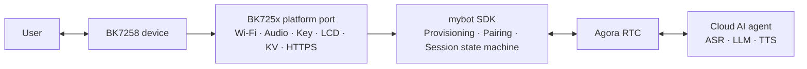

# mybot-bk7258

[](LICENSE)
[](https://github.com/junlon2006/mybot)
[](https://github.com/bekencorp/bk_avdk_smp)

**[简体中文](README.zh-CN.md) | English**

**mybot-bk7258** is the BK7258 SMP reference implementation of the open-source
[mybot](https://github.com/junlon2006/mybot) AI voice conversation SDK. This repository organizes
the BK7258 SMP SDK, the AI solution, the BK725x platform port, and a buildable dual-core firmware
project as pinned Git submodules. It is intended to provide reproducible builds, a practical
platform development baseline, and a shared foundation for community collaboration.

> This project is an actively developed BK7258 reference implementation. Before using it in a
> production product, complete the board-level adaptation, security review, and stability
> validation for the target hardware, and verify the licensing and commercial-use terms of all
> third-party components.

## Relationship to upstream mybot

[mybot](https://github.com/junlon2006/mybot) is a cross-platform AI voice conversation SDK for
edge devices. Its core is written in C99, uses AOSL as its portable runtime, and obtains device
capabilities such as Wi-Fi, persistent storage, buttons, displays, audio, and network transport
through platform `ops` interfaces.

This repository does not redefine the mybot SDK. It provides the complete implementation required
to run mybot on the BK7258 platform:

- BK7258 AP/CP dual-core startup, memory layout, and Flash partition configuration.
- BK725x Wi-Fi APSTA provisioning, network reconnection, and credential persistence.
- Microphone capture, speaker playback, volume control, and audio power management.
- Button, dual-display, EasyFlash KV, HTTPS, and device UID adapters.
- Full-duplex AI voice sessions over Agora RTSA, including user interruption of AI responses.
- Embedded Chinese and English OGG assets for provisioning prompts and pairing-code announcements.
- A complete flash image and an OTA package containing both the CP and AP firmware.

The device service, Agora RTC cloud service, and cloud AI agent are not part of this repository. A
device service compatible with the mybot protocol is required to run the complete workflow.

## System architecture



The BK7258 firmware uses an AP/CP dual-core architecture:

- **CP** performs base system initialization and SMP startup control.
- **AP** initializes the media service and starts the mybot controller. It hosts the platform
  adapters, device lifecycle, networking, audio, display, and RTC session.
- **Controller** selects APSTA provisioning or normal STA mode according to the saved Wi-Fi
  credentials. After the network connects, it starts the mybot SDK asynchronously and manages
  network recovery and unexpected SDK restarts.

## Repository layout

| Path | Responsibility | Tracking branch |
| --- | --- | --- |
| `bk_avdk_smp/` | BK7258 SMP SDK, Agora IoT SDK, AOSL, and platform foundation components | `release/v3.1.1-mybot` |
| `bk_solution_ai/` | AI solution, mybot SDK snapshot, BK725x platform port, and firmware project | `release/v3.1.1-mybot` |
| `bk_solution_ai/projects/mybot/` | AP/CP entry points, board configuration, partition table, and prompt assets | From `bk_solution_ai` |
| `bk_solution_ai/components/mybot/` | mybot core and the `platforms/bk725x` implementation | From `bk_solution_ai` |

The gitlinks in the top-level repository pin both submodules to exact commits so that every
development environment uses the same source revisions. The `branch` values in `.gitmodules`
are used only when maintainers explicitly update the submodules from their remotes.

## Requirements

- Git with Git submodule support.
- A Linux build environment and the cross-compilation toolchain required by `bk_avdk_smp`.
- A BK7258 development board or compatible hardware using the same peripheral connections.
- Access to a compatible mybot device service and valid Agora service configuration.

For BK7258 SDK environment setup and flashing tools, refer to the
[Beken BK7258 SMP documentation](https://docs.bekencorp.com/arminodoc/bk_avdk_smp/smp_doc/bk7258/en/v3.1.1/index.html).

## Get the source

Clone the repository and its submodules over HTTPS:

```bash
git clone --recurse-submodules https://github.com/junlon2006/mybot-bk7258.git
cd mybot-bk7258
```

If the top-level repository has already been cloned without its submodules, run:

```bash
git submodule sync --recursive
git submodule update --init --recursive
```

After cloning, inspect the pinned revisions with:

```bash
git submodule status
```

## Build the firmware

`bk_avdk_smp` and `bk_solution_ai` must remain sibling directories. Run the following commands
from the repository root:

```bash
make -C bk_solution_ai/projects/mybot clean SDK_DIR="$PWD/bk_avdk_smp"
make -C bk_solution_ai/projects/mybot bk7258 SDK_DIR="$PWD/bk_avdk_smp"
```

Build outputs are written to `bk_solution_ai/projects/mybot/build/bk7258/mybot/package/`:

| File | Purpose |
| --- | --- |
| `all-app.bin` | Complete flash image containing the bootloader, CP, and AP firmware |
| `app_pack.rbl` | OTA package containing both the CP and AP firmware |
| `build_summary.txt` | Flash, SRAM, ITCM, and DTCM usage report |

The individual CP and AP binaries are written to:

- `bk_solution_ai/projects/mybot/build/bk7258/mybot/bk7258/app.bin`
- `bk_solution_ai/projects/mybot/build/bk7258/mybot/bk7258_ap/app.bin`

## Flash and run

Use the Beken flashing tool to write `all-app.bin` to the device. Follow the instructions for the
target development board and the
[Beken flashing documentation](https://docs.bekencorp.com/arminodoc/bk_avdk_smp/smp_doc/bk7258/en/v3.1.1/get-started/index.html).

The reference device workflow is:

1. On first boot, or when no valid Wi-Fi credentials exist, the device enters APSTA provisioning
   mode and creates a `mybot-xxx` SoftAP.
2. Connect to the SoftAP and open `http://192.168.4.1/`, then select the target network and submit
   its credentials.
3. After connecting to the network, the device starts the mybot SDK and performs device
   registration, pairing, and authentication.
4. An unclaimed device displays and announces its pairing code. After the device is claimed, use
   the action button to start an AI voice conversation.

The current reference-board button mapping is:

| GPIO | Action | Function |
| --- | --- | --- |
| GPIO13 | Short press | Increase volume |
| GPIO8 | Short press | Decrease volume |
| GPIO12 | Short press | Start or stop a conversation |
| GPIO12 | Long press, approximately 3 seconds | Re-enter provisioning mode |

GPIO assignments and display and audio peripheral connections are board-level configuration.
Porting to different BK7258 hardware requires corresponding configuration and platform changes.

## Configuration

The primary project configuration files are:

- AP: `bk_solution_ai/projects/mybot/ap/config/bk7258_ap/config`
- CP: `bk_solution_ai/projects/mybot/cp/config/bk7258/config`
- Flash partitions: `bk_solution_ai/projects/mybot/partitions/bk7258/auto_partitions.csv`
- SRAM/PSRAM layout: `bk_solution_ai/projects/mybot/partitions/bk7258/ram_regions.csv`

The mybot Kconfig currently provides:

- `CONFIG_MYBOT_LANGUAGE_ZH_CN`: Chinese service region and Chinese prompt assets.
- `CONFIG_MYBOT_LANGUAGE_EN_US`: English service region and English prompt assets.
- `CONFIG_MYBOT_DEBUG_CPU`: Periodically print CPU usage diagnostics; disabled by default.

The language option selects both the service region and the prompt asset directory. Exactly one of
the two language options must be enabled.

## Embedded voice assets

Prompt assets are stored under `bk_solution_ai/projects/mybot/assets/locales/` as 16 kHz mono
Opus-in-Ogg files. They are compiled into the AP firmware as read-only C arrays, require no SD
card, and use no separate `assets_data` partition. Decoded PCM buffers are allocated from PSRAM
at runtime.

After modifying or adding an OGG file, regenerate the C arrays manually before building:

```bash
python3 bk_solution_ai/projects/mybot/scripts/generate_assets_c.py \
  bk_solution_ai/projects/mybot/assets \
  bk_solution_ai/components/mybot/platforms/bk725x/modules/storage/mybot_assets.c
```

The generator collects only `locales/**/*.ogg`. See
[`projects/mybot/assets/README.md`](bk_solution_ai/projects/mybot/assets/README.md) for the audio
format and update procedure.

## Submodule version management

Regular users should keep the revisions pinned by the top-level repository:

```bash
git pull --ff-only
git submodule sync --recursive
git submodule update --init --recursive
```

Maintainers can explicitly update both mybot branches with:

```bash
git submodule update --remote --checkout bk_avdk_smp bk_solution_ai
git diff --submodule=log
```

After an update, build and validate both submodules before updating the gitlinks in the top-level
repository. Do not commit `build/`, `__pycache__/`, or other locally generated files from a
submodule.

## Documentation

- [mybot project](https://github.com/junlon2006/mybot)
- [mybot English documentation](https://github.com/junlon2006/mybot/blob/main/README.md)
- [mybot porting guide](https://github.com/junlon2006/mybot/blob/main/docs/PORTING.md)
- [mybot embedded integration guide](https://github.com/junlon2006/mybot/blob/main/docs/EMBEDDED.md)
- [BK7258 platform component notes](bk_solution_ai/components/mybot/README.md)

## Contributing

Issues and pull requests are welcome:

- Submit platform-independent SDK features and public API changes to the
  [upstream mybot project](https://github.com/junlon2006/mybot).
- Submit BK7258 platform or firmware changes to
  [bk_solution_ai](https://github.com/junlon2006/bk_solution_ai) or
  [bk_avdk_smp](https://github.com/junlon2006/bk_avdk_smp), then update the corresponding submodule
  pointer in this repository.
- Report integration, build, and documentation issues in
  [mybot-bk7258 Issues](https://github.com/junlon2006/mybot-bk7258/issues).

Keep each change focused. Describe the hardware, configuration, and validation used, and do not
commit build artifacts.

## License and third-party dependencies

Original content in this top-level repository is licensed under the
[Apache License 2.0](LICENSE).

The two submodules and their third-party components are governed by their respective licenses and
terms of use, including but not limited to:

- [bk_avdk_smp license](bk_avdk_smp/LICENSE)
- [bk_solution_ai license](bk_solution_ai/LICENSE)
- [mybot SDK license](bk_solution_ai/components/mybot/LICENSE)
- [AOSL license and additional terms](bk_avdk_smp/ap/components/bk_thirdparty/agora-iot-sdk/hal/aosl/LICENSE)
- [Prompt asset license](bk_solution_ai/projects/mybot/assets/LICENSE.xiaozhi-esp32)
- [mybot third-party notices](https://github.com/junlon2006/mybot/blob/main/THIRD_PARTY_NOTICES.md)

Prebuilt binaries such as Agora RTSA may be subject to evaluation periods, redistribution
restrictions, and commercial licensing requirements. Before using this project in a product or
distributing firmware, independently review and comply with all applicable terms.
