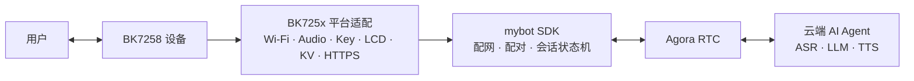

# mybot-bk7258

[](LICENSE)
[](https://github.com/junlon2006/mybot)
[](https://github.com/bekencorp/bk_avdk_smp)

**简体中文 | [English](README.md)**

**mybot-bk7258** 是开源 AI 语音对话 SDK
[mybot](https://github.com/junlon2006/mybot) 面向 BK7258 SMP 平台的参考实现。
本仓库将 BK7258 SMP SDK、AI 解决方案、BK725x 平台适配和可直接构建的双核固件工程
以 Git submodule 方式组织并固定到经过验证的版本，用于复现构建、平台开发和社区协作。

> 本项目当前定位为 BK7258 参考实现，仍在持续开发中。用于量产产品前，请结合实际硬件
> 完成板级适配、安全审查、稳定性验证，并确认所有第三方组件的许可与商业使用条件。

## 与上游 mybot 的关系

[mybot](https://github.com/junlon2006/mybot) 是面向边缘设备的跨平台 AI 语音对话 SDK。
其核心采用 C99 编写，依赖 AOSL 提供可移植运行时，并通过平台 `ops` 接口获取 Wi-Fi、
持久化存储、按键、显示、音频和网络传输等设备能力。

本仓库不重新定义 mybot SDK，而是提供 BK7258 平台所需的完整实现：

- BK7258 AP/CP 双核启动、内存和 Flash 分区配置。
- BK725x Wi-Fi APSTA 配网、网络重连和凭据持久化。
- 麦克风采集、扬声器播放、音量控制及音频电源管理。
- 按键、双屏显示、EasyFlash KV、HTTPS 和设备 UID 适配。
- 基于 Agora RTSA 的全双工 AI 语音会话，并支持用户打断 AI 回复。
- 配网提示和配对码播报所需的中英文内嵌 OGG 资源。
- 完整烧录固件以及同时包含 CP、AP 的 OTA 升级包。

设备服务端、Agora RTC 云服务和云端 AI Agent 不属于本仓库。运行完整业务流程需要接入
与 mybot 协议兼容的设备服务。

## 系统架构



BK7258 固件采用 AP/CP 双核结构：

- **CP** 负责基础系统初始化和 SMP 启动控制。
- **AP** 初始化媒体服务并启动 mybot controller，承载平台适配、设备生命周期、网络、
  音频、显示和 RTC 会话。
- **Controller** 根据已保存的 Wi-Fi 凭据选择 APSTA 配网或普通 STA 模式；网络连接后
  异步启动 mybot SDK，并负责断网恢复及异常重启。

## 仓库结构

| 路径 | 职责 | 跟踪分支 |
| --- | --- | --- |
| `bk_avdk_smp/` | BK7258 SMP SDK、Agora IoT SDK、AOSL 和平台基础组件 | `release/v3.1.1-mybot` |
| `bk_solution_ai/` | AI 解决方案、mybot SDK 快照、BK725x 平台适配和固件工程 | `release/v3.1.1-mybot` |
| `bk_solution_ai/projects/mybot/` | AP/CP 入口、板级配置、分区表和提示音资源 | 随 `bk_solution_ai` |
| `bk_solution_ai/components/mybot/` | mybot 核心及 `platforms/bk725x` 平台实现 | 随 `bk_solution_ai` |

顶层仓库中的 gitlink 固定两个子模块的准确提交，从而保证不同开发环境使用相同源码。
`.gitmodules` 中的 `branch` 仅用于维护者执行远端更新时选择目标分支。

## 环境要求

- Git，并支持 Git submodule。
- Linux 构建环境及 `bk_avdk_smp` 所需的交叉编译工具链。
- BK7258 开发板或采用相同外设连接的兼容硬件。
- 可用的 mybot 设备服务和 Agora 服务配置。

BK7258 SDK 环境和烧录工具的安装方法请参考
[Beken BK7258 SMP 文档](https://docs.bekencorp.com/arminodoc/bk_avdk_smp/smp_doc/bk7258/zh_CN/v3.1.1/index.html)。

## 获取源码

推荐通过 HTTPS 递归克隆：

```bash
git clone --recurse-submodules https://github.com/junlon2006/mybot-bk7258.git
cd mybot-bk7258
```

已经克隆顶层仓库但尚未获取子模块时执行：

```bash
git submodule sync --recursive
git submodule update --init --recursive
```

克隆完成后，可用以下命令确认固定版本：

```bash
git submodule status
```

## 构建固件

`bk_avdk_smp` 与 `bk_solution_ai` 必须保持为同级目录。请从本仓库根目录执行：

```bash
make -C bk_solution_ai/projects/mybot clean SDK_DIR="$PWD/bk_avdk_smp"
make -C bk_solution_ai/projects/mybot bk7258 SDK_DIR="$PWD/bk_avdk_smp"
```

构建结果位于 `bk_solution_ai/projects/mybot/build/bk7258/mybot/package/`：

| 文件 | 用途 |
| --- | --- |
| `all-app.bin` | 包含 bootloader、CP 和 AP 的完整烧录固件 |
| `app_pack.rbl` | 同时包含 CP 和 AP 的 OTA 升级包 |
| `build_summary.txt` | Flash、SRAM、ITCM 和 DTCM 使用情况 |

CP、AP 独立二进制分别位于：

- `bk_solution_ai/projects/mybot/build/bk7258/mybot/bk7258/app.bin`
- `bk_solution_ai/projects/mybot/build/bk7258/mybot/bk7258_ap/app.bin`

## 烧录与运行

使用 Beken 烧录工具将 `all-app.bin` 写入设备。具体烧录流程以所用开发板和
[Beken 烧录文档](https://docs.bekencorp.com/arminodoc/bk_avdk_smp/smp_doc/bk7258/zh_CN/v3.1.1/get-started/index.html)
为准。

设备启动后的参考流程如下：

1. 首次启动或没有有效 Wi-Fi 凭据时，设备进入 APSTA 配网模式并创建
   `mybot-xxx` SoftAP。
2. 连接该热点并访问 `http://192.168.4.1/`，选择目标网络并提交凭据。
3. 设备连接网络后启动 mybot SDK，完成设备注册、配对和认证。
4. 未认领设备会显示并播报配对码；完成认领后即可通过按键开始 AI 语音会话。

当前参考板按键定义如下：

| GPIO | 操作 | 功能 |
| --- | --- | --- |
| GPIO13 | 短按 | 增大音量 |
| GPIO8 | 短按 | 减小音量 |
| GPIO12 | 短按 | 开始或结束会话 |
| GPIO12 | 长按约 3 秒 | 重新进入配网模式 |

GPIO、显示屏和音频外设连接属于板级配置；适配其他 BK7258 硬件时需要同步修改配置和
平台实现。

## 配置

主要工程配置位于：

- AP：`bk_solution_ai/projects/mybot/ap/config/bk7258_ap/config`
- CP：`bk_solution_ai/projects/mybot/cp/config/bk7258/config`
- Flash 分区：`bk_solution_ai/projects/mybot/partitions/bk7258/auto_partitions.csv`
- SRAM/PSRAM：`bk_solution_ai/projects/mybot/partitions/bk7258/ram_regions.csv`

mybot Kconfig 当前提供：

- `CONFIG_MYBOT_LANGUAGE_ZH_CN`：中文服务区域和中文提示音。
- `CONFIG_MYBOT_LANGUAGE_EN_US`：英文服务区域和英文提示音。
- `CONFIG_MYBOT_DEBUG_CPU`：周期性输出 CPU 使用率诊断信息，默认关闭。

语言选项会同时决定服务区域与提示音目录，两个语言选项必须且只能启用一个。

## 内嵌语音资源

提示音位于 `bk_solution_ai/projects/mybot/assets/locales/`，格式为 16 kHz 单声道
Opus-in-Ogg。资源以只读 C 数组编入 AP 固件，不依赖 SD 卡，也不使用独立的
`assets_data` 分区；解码后的 PCM 缓冲区在运行时从 PSRAM 分配。

修改或新增 OGG 后，需要在构建前手动重新生成数组：

```bash
python3 bk_solution_ai/projects/mybot/scripts/generate_assets_c.py \
  bk_solution_ai/projects/mybot/assets \
  bk_solution_ai/components/mybot/platforms/bk725x/modules/storage/mybot_assets.c
```

生成器只收集 `locales/**/*.ogg`。详细格式及更新流程见
[`projects/mybot/assets/README.md`](bk_solution_ai/projects/mybot/assets/README.md)。

## 子模块版本管理

普通使用者应使用顶层仓库固定的版本：

```bash
git pull --ff-only
git submodule sync --recursive
git submodule update --init --recursive
```

维护者需要更新 mybot 分支时，可执行：

```bash
git submodule update --remote --checkout bk_avdk_smp bk_solution_ai
git diff --submodule=log
```

更新后必须分别完成构建和设备验证，再在顶层仓库更新 gitlink。不要提交子模块内的
`build/`、`__pycache__/` 或其他本地生成文件。

## 文档

- [mybot 项目](https://github.com/junlon2006/mybot)
- [mybot 中文文档](https://github.com/junlon2006/mybot/blob/main/README.zh-CN.md)
- [mybot 移植指南](https://github.com/junlon2006/mybot/blob/main/docs/PORTING.zh-CN.md)
- [mybot 嵌入式集成指南](https://github.com/junlon2006/mybot/blob/main/docs/EMBEDDED.zh-CN.md)
- [BK7258 平台组件说明](bk_solution_ai/components/mybot/README.md)

## 贡献

欢迎通过 Issue 和 Pull Request 参与改进：

- 平台无关的 SDK 功能和公共接口改动，请优先提交到
  [mybot 上游项目](https://github.com/junlon2006/mybot)。
- BK7258 平台适配和固件工程改动，应提交到对应的
  [bk_solution_ai](https://github.com/junlon2006/bk_solution_ai) 或
  [bk_avdk_smp](https://github.com/junlon2006/bk_avdk_smp) 仓库，再更新本仓库的
  submodule 指针。
- 集成、构建和文档问题可提交到
  [mybot-bk7258 Issues](https://github.com/junlon2006/mybot-bk7258/issues)。

提交代码前请保持改动范围清晰，说明使用的硬件、配置和验证方式，并避免将构建产物
提交到版本库。

## 许可证与第三方依赖

本顶层仓库中的原创内容采用 [Apache License 2.0](LICENSE)。

两个子模块及其中的第三方组件分别适用其自身许可和使用条款，包括但不限于：

- [bk_avdk_smp 许可证](bk_avdk_smp/LICENSE)
- [bk_solution_ai 许可证](bk_solution_ai/LICENSE)
- [mybot SDK 许可证](bk_solution_ai/components/mybot/LICENSE)
- [AOSL 许可证及附加条款](bk_avdk_smp/ap/components/bk_thirdparty/agora-iot-sdk/hal/aosl/LICENSE)
- [提示音资源许可证](bk_solution_ai/projects/mybot/assets/LICENSE.xiaozhi-esp32)
- [mybot 第三方依赖说明](https://github.com/junlon2006/mybot/blob/main/THIRD_PARTY_NOTICES.md)

Agora RTSA 等预编译二进制可能受试用期限、再分发和商业授权限制。将本项目用于产品或
对外分发固件前，请独立核实并遵守所有适用条款。
